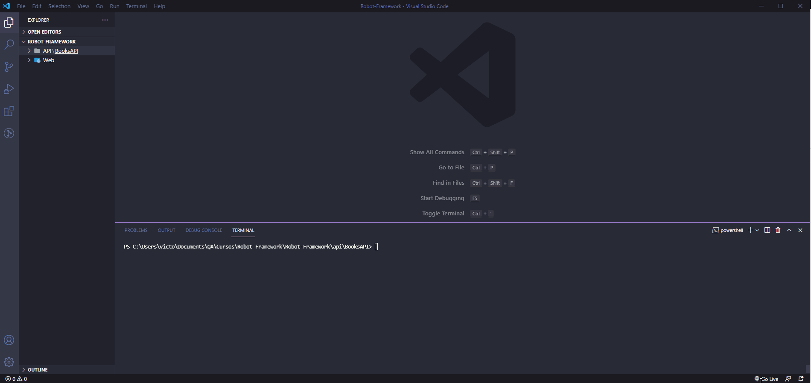

# Robot Framework Basics

## 🐱‍👤 About
This project is an Web and API REST test automation with Robot Framework.

## 🐱‍🏍 Applications

**Web:** [Automation Practice](http://automationpractice.com/index.php)

**API:** [FakeRESTApi](https://fakerestapi.azurewebsites.net/index.html)

## 🐱‍💻 Course 

[Automação de Testes com Robot Framework - Básico](https://www.udemy.com/course/automacao-de-testes-com-robot-framework-basico/)

## :robot: Robot Framework
- Enables easy-to-use **tabular syntax** for creating test cases in a uniform way
- Provides ability to create **reusable higher-level keywords** from the existing keywords
- Is **platform and application independent**
- Provides a simple library API for **creating customized test libraries** which can be implemented natively with either **Python or Java**
- Provides easy-to-read **result reports and logs** in **HTML format**
- Supports creating **data-driven test cases**

   *Reference: [Robot Framework User Guide](https://robotframework.org/robotframework/2.8.7/RobotFrameworkUserGuide.html)*

## :computer: Installation
### Install Python 3
- Mark the option “Add Python 3.x to PATH” on Python installer (.exe file)
- Verify if it was installed: `python --version` 

### Install Robot Framework 
- `pip install robotframework`
- Verify if it was installed: `robot --version` or `pip show robotframework`
 
### Install the Libraries    
- Install SeleniumLibrary: `pip install --upgrade robotframework-seleniumlibrary`
- Install HTTP RequestsLibrary: `pip install --upgrade robotframework-requests`
- Install Faker: `pip install --upgrade robotframework-faker`
- Check the list of installed libraries: `pip list`
    
### Web Drivers (for web testing)
Download and extract the executable files of correspondent Operational System:
- Firefox (select the latest version): https://github.com/mozilla/geckodriver/releases
- Chrome (select the version according to chrome browser's version): https://chromedriver.chromium.org/downloads

### Extensions for Visual Studio Code
- **Robot Framework Intellisense** *by Tomi Turtiainen* supports Robot Framework development
- **Robot Framework Language Server** *by Robocorp* useful for document formatter and variable, language and keyword autocomplete, and other resources

## :rocket: Usage

**Run all tests:**
`robot Tests`

**Set report directory:**
`robot -d .\Results Tests`

**Run specific file:**
`robot .\Tests\<file_name.robot>`

Example: `robot .\Tests\TestCasesAPIBooks-EN.robot`

**Run specific test case:**
`robot -t <"test_case_name"> Tests`

   Example: `robot -t "Register a new book(POST)" Tests`

## :sparkles: Visuals
Example API automation:

## References
- [Robot Framework User Guide](https://robotframework.org/robotframework/2.8.7/RobotFrameworkUserGuide.html)
- [BuiltIn Library](http://robotframework.org/robotframework/latest/libraries/BuiltIn.html)
- [Selenium Library](https://robotframework.org/SeleniumLibrary/SeleniumLibrary.html)
- [Collections Library](http://robotframework.org/robotframework/latest/libraries/Collections.html)
- [Faker Library](https://guykisel.github.io/robotframework-faker/)
- [Requests Library](https://marketsquare.github.io/robotframework-requests/doc/RequestsLibrary.html)

## License
[MIT](https://choosealicense.com/licenses/mit/)

